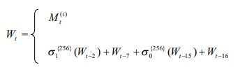
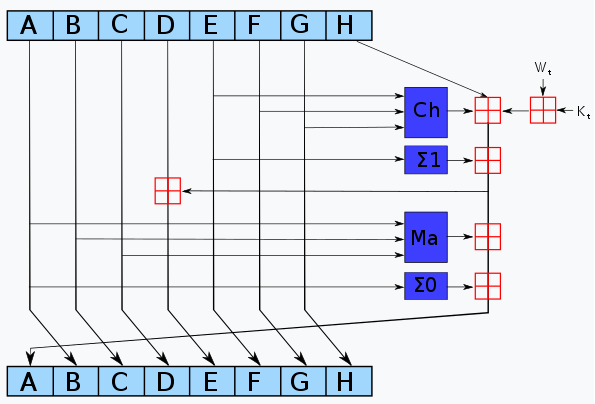

# Funciones de hash

Una funcion de hash, en su forma mas simple, es una funcion que toma un input (mensaje) de tamaño indeterminado y da como resultado una _palabra_ de tamaño fijo **_N_** (es decir una combinacion de tamaño fijo de un conjunto de elementos determinados, generalmente bits - _**{0,1}**_ sus elementos). Esta funcion debe ser **deterministica**, es decir, dado el mismo mensaje siempre dara el mismo resultado. 

Dado que el tamaño de todos los elementos que pueden ser el elemento de entrada es infinito, y los resultados son finitos, existiran al menos dos(y en general, infinitos) elementos de entrada que den como resultado la misma _palabra_ ([Pigeonhole principle](https://en.wikipedia.org/wiki/Pigeonhole_principle)). A esto, se le llama **colision**.

## Funciones de hash criptograficas
Son un conjunto de funciones de hash que tienen ciertas caracteristicas deseables:

- La probabilidad de que, dado un mensaje, se obtenga un resultado es uniforme dentro de todos los posibles resultados
- Buscar la pre-imagen de un resultado de hash es computacionalmente inviable.
- Encontrar dos mensajes que tengan la misma imagen es computacionalmente inviable (Ya sea teniendo un mensaje _**M**_ o cualquier par).

En general, una funcion de hash criptografica va a buscar que las **colisiones** sean improbables (al menos en un tiempo computacional viable). De esta manera, se logra que cualquier _adversario_ que quiera modificar el mensaje obtenga un resultado diferente.

El **efecto avalancha** es una propiedad deseada en una funcion de hash criptografica, la cual dice que cualquier cambio en el elemento de entrada, produce un elemento de salida sustancialmente diferente. Esto ayuda a que calcular la pre-imagen sea mas dificil computacionalmente. 

Ademas, debe ser computacionalmente rapidas de calcular. 

### SHA-2
Es un conjunto de funciones de hashs criptograficas - **SHA-224, SHA-256, SHA-384, SHA-512**. La estructura de la funcion entre las diferentes funciones se mantiene identica; la unica diferencia entre ellas es el tamaño de palabra y bloques (32 bits, 512 respectivamente para **SHA-224, SHA-256**, 64 bits, 1024 bits respectivamente para **SHA-384, SHA-512**), la cantidad de rondas y el tamaño de la _palabra_ de salida. A menor tamaño de bloque, menor tiempo de computo, pero menor seguridad, y viceversa. 

#### Funcionamiento
0. **Estado Inicial**: Cada funcion tendra un estado de hash inicial diferente. 

1. **Padding**: El primer paso de las funciones **SHA-2** es agregar un padding al mensaje que se tiene que hashear. Esto es a fin de que el tamaño del mensaje sea un multiplo del tamaño de bloque. El padding consiste en agregar 1 bit al final del mensaje, una cantidad suficiente de 0 y luego el tamaño del mensaje original, en bits, en los ultimos bits del mensaje con el padding.

1. **Dividir el mensaje en bloques**: Se divide el mensaje(ya con el _padding_) en **_N_** bloques que seran procesados en serie, modificando el estado del hash.

1. **Por cada bloque**:

   1. **Preparar el _schedule_ del mensaje**: Es una extension del bloque, donde los primeros bytes son el bloque en si, mientras que los siguientes son el resultado de aplicar funciones (movimientos de bits y sumas en modulo 2 ^ (tamaño de palabra)). El tamaño de este dependera de la cantidad de rondas que se realicen segun la funcion de hash.

       
   
   1. **Por cada palabra en el _schedule_ realizar la funcion de ronda de SHA-2**: Se realizaran operaciones de movimientos de bits y sumas en modulo 2 ^ (tamaño de palabra) para actualizar el estado del hash. **A, B, C, D, E, F, G, H** son el estado del hash (el inicial, o los estados intermedios resultados de procesas bloques anteriores). Los elementos Kt son palabras constantes definidas en el standard para cada funcion. Dada la naturaleza de la construccion del _schedule_ y la forma de la funcion de ronda de SHA-2, aqui es donde se consigue el efecto avalancha.

      

1. **Resultado**: El resultado de la funcion de hash sera el estado del mismo luego de procesas todos los bloques del mensaje. Cabe destacar que tanto **SHA-224** y **SHA-384** se computan de la misma manera que **SHA-256** y **SHA-512** respectivamente, pero el tienen un estado inicial diferente y sus resultados son truncados a la cantidad correcta de bits. 

## Aplicaciones funciones de hash
Las funciones de hash se utilizan, principalmente, como una 'identidad' del mensaje. Esta identidad sera tan unica como la funcion de hash usada pueda garantizar. Es decir, si se usan funciones de hash criptograficas, esta identidad sera relativamente 'unica' debido a las caracteristicas de la funcion. En cambio, si las funciones usadas no son criptograficas y no pueden garantizar la baja probabilidad de colision, la 'unicidad' sera baja. 

### Aplicaciones no criptograficas
La mayor aplicacion de funciones de hash no criptograficas son en estructuras de datos como tablas de hash.

### Aplicaciones criptograficas
- **Integridad de la informacion** El hash de un mensaje permanece constante. Si al volver a realizar el hash del mensaje, se obtiene un resultado diferente, esto quiere decir que el mensaje fue alterado. Ademas, por el efecto avalancha, el resultado debera ser totalmente diferente 
- **Firmas digitales** Se utilizan, junto a funciones de encriptacion, para asegurar que un mensaje encriptado no fue alterado de ninguna manera, y a la vez fue firmado por la persona correcta.
- **Verificacion de contraseñas** A fin de evitar guardar la contraseña en formato de texto plano, se guarda el resultado de pasarlo por una funcion de hash criptografica. Para luego verificar que la contraseña es la correcta, simplemente se comparan los resultados de los hashes.
- **Prueba de trabajo** Sirve para verificar que un trabajo que fuera dificil (pero viable computacionalmente) fue realizado. La verificacion debe ser facil (generalmente calcular el resultado del hash del trabajo realizado)
- **Identificador de infomacion** Dada la casi nula posibilidad de colision, se puede utilizar como resultado de identificador unico de informacion. Ciertas estructuras de datos (arbol de merkle, por ejemplo) o sistemas como Git lo utilizan de esta manera.  
